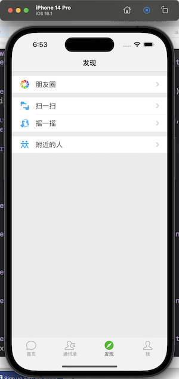

# swift-demo
## 01-tableview
**功能：**
UITabbarController+UINavigationController+UITableView基本展示，并解决一些基础的tabbar的字体大小等小问题

### 遇到问题
1. tabBar 背景色
```objc
tabBar.barTintColor = bgColor
tabBar.backgroundColor = bgColor //一定要设置，否则第二个tabbar退到首页再进可能会变色
```

2. iOS15之后导航栏设置需要特殊处理
[IOS15之UINavigationBar背景颜色不全](https://www.jianshu.com/p/ac6ccca005f8 )

```objc
func setNavStyle(){
    if #available(iOS 15.0,*) {
        let appearance = UINavigationBarAppearance()
        appearance.titleTextAttributes = [NSAttributedString.Key.foregroundColor:UIColor.white]
        appearance.backgroundColor = UIColor(red: 66/256.0, green: 176/256.0, blue: 216/256.0, alpha: 1)
        navigationController?.navigationBar.standardAppearance = appearance;
        navigationController?.navigationBar.scrollEdgeAppearance = appearance;
    } else {
        navigationController?.navigationBar.titleTextAttributes = [NSAttributedString.Key.foregroundColor:UIColor.white]
        //设置导航栏背景颜色
        navigationController?.navigationBar.barTintColor = UIColor(red: 66/256.0, green: 176/256.0, blue: 216/256.0, alpha: 1)
        navigationController?.navigationBar.isTranslucent = false
    }
}
```

## 02-tableview-home
参照[仿微信](https://github.com/developerjet/JetChat)，修复首页
**功能**
1.优化整体架构
2.首页展示优化

### 遇到问题
1. [M1 pod install CocoaPod 报错解决办法](https://blog.csdn.net/Morris_/article/details/118669618)

```objc
sudo arch -x86_64 gem install ffi
arch -x86_64 pod install
arch -x86_64 pod update
```

2. [block闭包](https://www.jianshu.com/p/279406459686)

```objc
//KXRequest.swift
typealias RequestBlock = (_ name:String)->Void;
var block : RequestBlock?;
func show(){
    self.block?("kx");
}
//ViewController.swift
let request = KXRequest();
request.block = {(name:String) in
    print(name);
};
request.show(); 
```

## 03-tableview-ui
[Tableview核心参照[UITableView 的 type 为 grouped 时内容起点向下偏移](https://juejin.cn/post/7011395585618133029)这一篇文章即可，目前已经实现的效果如下

